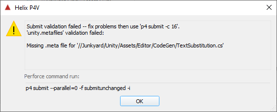

# p4unity

The Unity engine uses a system of [paired metadata files](https://docs.unity3d.com/Manual/BehindtheScenes.html) when managing imported asset files. These files contain - amongst other data - the GUIDs that underpin how assets are referenced between each other. 

Forgetting to check in a .meta file - or forgetting to delete one - in lockstep with the asset can cause a ripple of issues, especially on complex projects with larger (and/or distributed) teams. Discovering a missing .meta will cause Unity to generate a fresh GUID, snapping any existing references the asset had.

To help avoid accidental .meta file abuse, `p4unity` provides a `change-content` trigger callback that can validate changelists, halting progress if issues are detected.



Built with Go, it can run on any platform P4 server supports, has no installation dependencies, is trivially configurable .. and it's pretty fast, too. Validating a 3100 file check-in of HDRP takes ~70ms on a local Win10 VM (SSD, i5-8600K)

## Checks

* Assets added without accompanying .meta
* .meta added without accompanying asset ( ignoring directory .meta files )
* .meta files being deleted or moved without accompanying asset

`p4unity` correctly ignores directories suffixed with `~` and any `.` prefixed items 

Validation can be overruled using a configurable commit-message key phrase, eg `"p4unity-bypass"`

## Example Installation

* Copy the build somewhere on the P4 server machine
* Copy the configuration YAML to the root of the P4 server directory, customise as desired
* Add trigger callback via `p4 triggers` command-line; call the exe with `%changelist%` as the first argument

```
Triggers:
	unity.metafiles change-content //... "Z:\p4unity.exe %changelist%"
```

## Configuration

the `p4unity.yaml` is loaded on startup; it allows

* setting perforce port, if different than simply `localhost:1666`
* enabling verbose logging for debugging
* choosing a bypass keyphrase to allow commits to avoid being validated, if required
* which depot paths should be whitelisted for validation; "//" by default examines all commits

It is also possible to override some configuration values via environment variables (check the YAML file for details) - ***they must be set at the System level, not User, as the P4 server will not be running on the user account***.

## Debugging

Enabling verbose logging will produce a structured log under `/p4unity_logs`, next to the P4 server root directory. Each invocation creates a unique log file. Comprehensive tracing of inputs, filtering and decisions are written out to help understand what's going on

```json
{
	"level":"info",
	"ts":1586716363.972223,
	"caller":"p4unity/main.go:258",
	"msg":"Candidate",
	"original-spec":"//Junkyard/Unity/LocalPackages/com.unity.render-pipelines.high-definition/Documentation~/Images/CustomPass_Glitch_ShaderGraph.png#1 add",
	"elements":
	[
		"//Junkyard/Unity/LocalPackages/com.unity.render-pipelines.high-definition/Documentation~/Images/CustomPass_Glitch_ShaderGraph.png#1 add",
		"//Junkyard/Unity/LocalPackages/com.unity.render-pipelines.high-definition/Documentation~/Images/CustomPass_Glitch_ShaderGraph.png",
		"1",
		"add"
	],
	"index":43,
	"dir-part":"//Junkyard/Unity/LocalPackages/com.unity.render-pipelines.high-definition/Documentation~/Images/",
	"file-part":"CustomPass_Glitch_ShaderGraph.png"
}
{
	"level":"info",
	"ts":1586716364.0080466,
	"caller":"p4unity/main.go:267",
	"msg":"TildeIgnored",
	"original-spec":"//Junkyard/Unity/LocalPackages/com.unity.render-pipelines.high-definition/Samples~/ShaderGraphSamples/Fabric/Cotton.mat.meta#1 add"
}
{
	"level":"info",
	"ts":1586716364.010367,
	"caller":"p4unity/main.go:273",
	"msg":"DotIgnored",
	"original-spec":"//Junkyard/Unity/LocalPackages/com.unity.render-pipelines.high-definition/Tests/.tests.json#1 add"
}
```